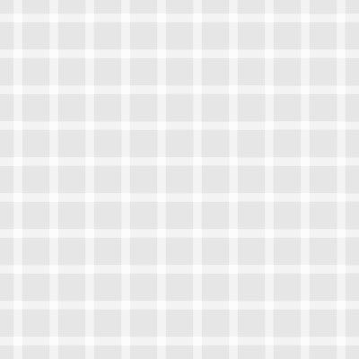

# Cutting

Cutting is a Processing implementation written in Ruby. It uses OpenGL and GLFW for the windows and drawing.

## Installation

Under construction

## Usage

At the moment you can test it by changing `example.rb` and running `make irb`. This will load an `irb` session that loads up the example.

## License

Cutting is licensed under the terms of the [GNU Affero General Public License version 3](https://github.com/Nirei/cutting/blob/main/LICENSE).

## Contributing

Bug reports and pull requests are welcome on GitHub at https://github.com/Nirei/cutting. This project is intended to be a safe, welcoming space for collaboration, and contributors are expected to adhere to the [code of conduct](https://github.com/Nirei/cutting/blob/main/CODE_OF_CONDUCT.md).

## Code of Conduct

Everyone interacting in the Cutting project's codebases, issue trackers, chat rooms and mailing lists is expected to follow the [code of conduct](https://github.com/Nirei/cutting/blob/main/CODE_OF_CONDUCT.md).

## Examples

The following is a little gallery of the examples that come with Cutting

#### Intersections
